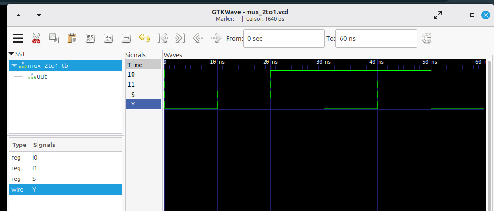
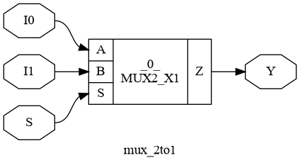

# Verilog Practice

A hands-on collection of Verilog HDL designs and RTL experiments focused on
digital logic design, simulation, synthesis, and static timing analysis.

This repository documents my progression from writing RTL to analyzing
synthesized designs and timing results using an open-source ASIC design flow.

---

## Overview

This repository contains Verilog RTL implementations, testbenches,
simulation results, synthesized netlists, and static timing analysis files.

The current work focuses on small digital designs such as multiplexers,
with each design progressing through different stages of the RTL-to-ASIC
design flow.

---

## Current Design Flow

```text
             Verilog RTL
                  │
                  ▼
              Testbench
                  │
                  ▼
           Icarus Verilog
                  │
                  ▼
              Simulation
                  │
                  ▼
               GTKWave
                  │
                  ▼
                Yosys
                  │
                  ▼
              Synthesis
                  │
                  ▼
            NanGate 45nm
         Technology Library
                  │
                  ▼
               OpenSTA
                  │
                  ▼
        Static Timing Analysis
```

---

## Current Work

### 2-to-1 Multiplexer

The 2-to-1 multiplexer is currently the most complete design in this
repository and has been taken through the following stages:

- Verilog RTL implementation
- Testbench development
- Functional simulation
- VCD waveform generation
- GTKWave waveform analysis
- RTL synthesis using Yosys
- Technology mapping using the NanGate 45nm Open Cell Library
- Static Timing Analysis using OpenSTA
- Timing analysis including WNS and TNS

### 4-to-1 Multiplexer

The 4-to-1 multiplexer currently includes:

- Verilog RTL implementation
- Testbench development
- Functional simulation
- VCD waveform generation
- GTKWave waveform analysis
- RTL synthesis using Yosys
- Synthesized netlist exploration
- Technology mapping using the NanGate 45nm Open Cell Library

Further timing analysis will be added as the design flow develops.

---

## 2-to-1 Multiplexer — RTL to STA

The 2-to-1 multiplexer is currently the most complete example of the
open-source ASIC design flow in this repository.

### Design Flow

```text
RTL Design
    │
    ▼
Functional Simulation
    │
    ▼
Waveform Analysis
    │
    ▼
RTL Synthesis
    │
    ▼
Technology Mapping
    │
    ▼
Static Timing Analysis
```

### 1. RTL Design

The multiplexer was implemented using synthesizable Verilog RTL.

**Source:**

```text
combinational/mux_2to1.v
```

### 2. Functional Simulation

The RTL was simulated using **Icarus Verilog** with a dedicated
testbench.

Simulation files and generated waveforms are available in:

```text
simulation/2_to_1_mux/
```

The generated VCD waveform was analyzed using **GTKWave**.

### 3. RTL Synthesis

The design was synthesized using **Yosys**.

The synthesized design was mapped to cells from the
**NanGate 45nm Open Cell Library**.

Synthesis files, mapped netlists, and the synthesized schematic are
available in:

```text
synthesis/2_to_1_mux/
```

### 4. Static Timing Analysis

Static Timing Analysis was performed using **OpenSTA**.

Timing constraints were defined using an SDC file, and timing reports
were generated for the synthesized design.

STA files and reports are available in:

```text
sta/2_to_1_mux/
```

The analysis includes:

- Maximum timing analysis
- Minimum timing analysis
- Worst Negative Slack (WNS)
- Total Negative Slack (TNS)
- Clock and I/O timing constraints

### Flow Status

| Stage | Tool / Technology | Status |
| --- | --- | --- |
| RTL Design | Verilog HDL | ✅ |
| Functional Simulation | Icarus Verilog | ✅ |
| Waveform Analysis | GTKWave | ✅ |
| RTL Synthesis | Yosys | ✅ |
| Technology Mapping | NanGate 45nm | ✅ |
| Static Timing Analysis | OpenSTA | ✅ |
| Power Analysis | — | 🔜 |
| Physical Design / GDS | — | 🔜 |

---

## Design Results

### GTKWave Simulation



### Synthesized Schematic



---

## Topics & Planned Practice

### Combinational Logic

- 2-to-1 Multiplexer
- 4-to-1 Multiplexer
- Decoder
- Encoder
- Comparator
- Half Adder
- Full Adder
- Subtractor

### Sequential Logic

- D Flip-Flop
- JK Flip-Flop
- Registers
- Shift Registers
- Up Counter
- Down Counter

### RTL Design

- Parameterized Modules
- Hierarchical Design
- Finite State Machines
- Synchronous Design Concepts

### Verification

- Basic Testbenches
- Self-Checking Testbenches
- Waveform Analysis
- Verilator-Based Checking

### Synthesis

- Basic RTL Synthesis
- Logic Utilization Analysis
- Synthesized Netlist Exploration
- Technology Mapping

The practice list will be updated as each topic is implemented and verified.

---

## Repository Structure

```text
Verilog-Practice/
│
├── combinational/
│   ├── mux_2to1.v
│   └── mux_4to1.v
│
├── simulation/
│   ├── 2_to_1_mux/
│   │   ├── mux_2to1_tb.v
│   │   ├── mux_2to1.vcd
│   │   ├── iverilog_output.png
│   │   └── waveform_from_GTKWave.png
│   │
│   └── 4_to_1_mux/
│       ├── mux_4to1_tb.v
│       ├── mux_4to1.vcd
│       ├── iverilog_output.png
│       └── waveform_from_GTKWave.png
│
├── synthesis/
│   ├── 2_to_1_mux/
│   │   ├── MUX2_X1.v
│   │   ├── mux_2to1.ys
│   │   ├── mux_2to1_45nm.v
│   │   ├── mux_schematic.dot
│   │   └── mux_schematic.png
│   │
│   └── 4_to_1_mux/
│       ├── MUX2_X1.v
│       ├── mux_4to1.ys
│       ├── mux_4to1_45nm.v
│       ├── mux_4to1_schematic.dot
│       └── mux_4to1_schematic.png
│
├── sta/
│   ├── 2_to_1_mux/
│   |   ├── mux_2to1.sdc
│   |   ├── run_sta.tcl
│   |   ├── max_timing.rpt
│   |   ├── min_timing.rpt
│   |   ├── wns.rpt
│   |   └── tns.rpt
|   └── 4_to_1_mux/
│       ├── mux_4to1.sdc
│       ├── run_sta.tcl
│       ├── max_timing.rpt
│       ├── min_timing.rpt
│       ├── wns.rpt
│       └── tns.rpt
│
├── testbenches/
│   ├── mux_2to1_tb.v
│   └── mux_4to1_tb.v
│
└── README.md
```

---

## Tools and Technologies

| Tool / Technology | Purpose |
| --- | --- |
| Verilog HDL | RTL design |
| Icarus Verilog | RTL simulation |
| GTKWave | Waveform analysis |
| Verilator | RTL checking and verification |
| Yosys | RTL synthesis |
| OpenSTA | Static Timing Analysis |
| NanGate 45nm OCL | Technology library |

---

## Learning Approach

Each design is approached through the following steps:

- Understand the digital logic concept
- Design the required logic
- Write the Verilog RTL
- Develop a testbench
- Simulate the design
- Analyze the simulation waveform
- Debug and improve the RTL
- Explore RTL synthesis
- Analyze synthesized netlists
- Apply timing constraints
- Perform static timing analysis where applicable

The goal is to understand not only how to write RTL, but also how the
design behaves through the stages of an ASIC design flow.

---

## Purpose

This repository is part of my continuous learning and preparation for
careers in:

- RTL Design
- ASIC Design
- VLSI Design
- Digital Design
- Functional Verification

The goal is to develop practical skills by progressing from:

```text
Digital Logic
     ↓
Verilog RTL
     ↓
Simulation
     ↓
Verification
     ↓
Synthesis
     ↓
Technology Mapping
     ↓
Static Timing Analysis
```

---

## Future Direction

As my RTL and ASIC design skills develop, the practice work will progress
toward more advanced designs such as:

- Arithmetic Units
- ALUs
- Memory Interfaces
- UART
- SPI
- FSM-Based Controllers
- Pipelined RTL Designs
- Parameterized RTL Modules
- Power Analysis
- Physical Design
- GDS Generation

These exercises will provide a foundation for larger ASIC and RTL design
projects.

---

## Author

**Sudeep T. Gotur**

Electronics and Communication Engineering  
KLS Vishwanath Rao Deshpande Institute of Technology
